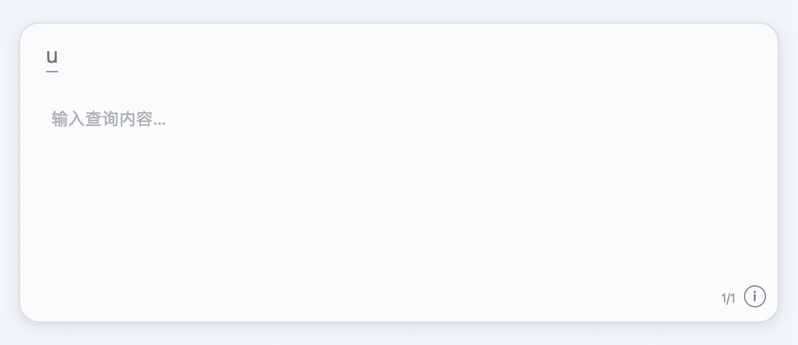
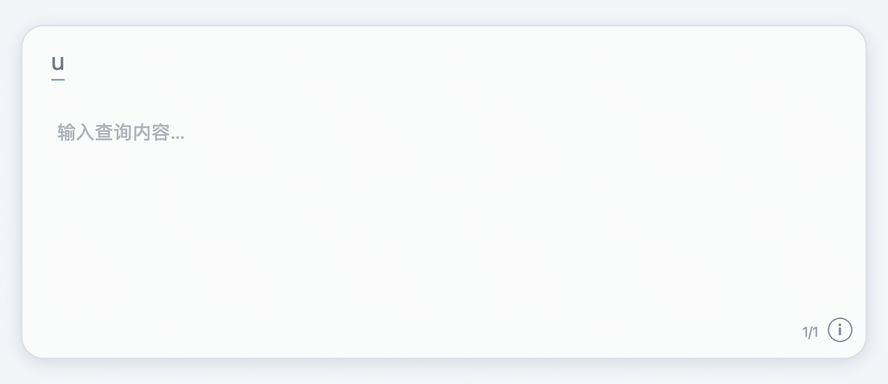
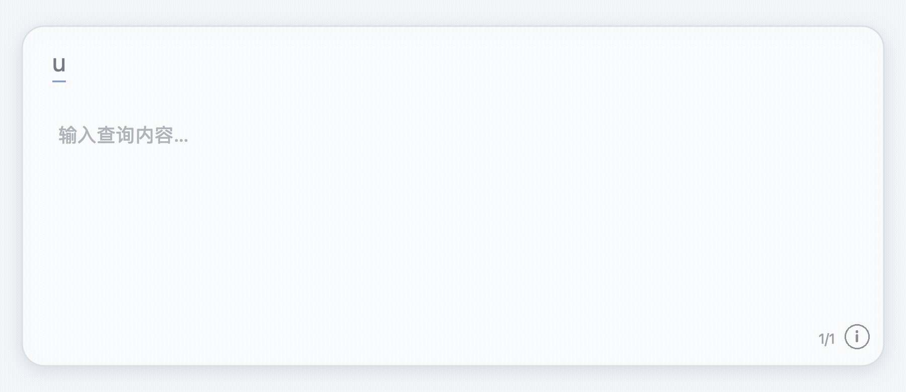

# SquirrelTranslate

macOS 上 Squirrel（Rime）的候選翻譯與快速查詢面板，提供候選翻譯、IP 與電話號碼歸屬地查詢、日期／時間／單位轉換及取色工具。

語言版本：[简体中文](./README.md) · [繁體中文](./README.zh-Hant.md) · [English](./README.en.md) · [한국어](./README.ko.md) · [日本語](./README.ja.md)

產品介紹頁：[SquirrelTranslate](https://owllinker.github.io/SquirrelTranslate/)

## 核心功能示範

以下動畫依 U 面板樣式製作，為操作示意而非實機錄影。手機號碼及本機／公網 IP 均已遮罩；指定 IP 範例顯示 `8.8.8.8` 的查詢結果。

**候選翻譯：**輸入 `u` 前綴與拼音，顯示候選詞、譯文及可用音標。

**IP 查詢：**輸入 `uip` 與完整 IPv4，面板會查詢 IP 地區與網路服務商。

**手機號碼歸屬地：**輸入電話號碼，以本機號段資料顯示地區及電信商；示範號碼已遮罩。

## 鼠鬚管一般候選面板

鼠鬚管候選面板顯示時可使用下列快捷鍵；一般文字輸入仍由鼠鬚管與目前的 Rime 方案處理。

| 快捷鍵 | 功能 |
| --- | --- |
| `⌃T` | 開啟／關閉候選翻譯 |
| `⌃P` | 朗讀目前選取的譯文；譯文尚未就緒時不朗讀原文 |
| `⌃Y` | 將目前候選詞的譯文上屏 |
| `⇧^` | 展開／收合完整釋義及音標 |
| `⇧P` | 開啟／關閉音標顯示 |
| `⌃G` / `⌃B` | 使用預設／第二搜尋引擎搜尋醒目候選詞 |
| `⌃N` | 透過預設瀏覽器在新聞擴充功能中搜尋醒目候選詞 |
| `⌘,` | 開啟／關閉快捷鍵說明 |

中文候選詞預設翻譯為英文，英文候選詞翻譯為中文；有音標時一併顯示。Emoji 名稱使用本機資料，不會傳送至線上翻譯服務。候選編號與翻頁按鍵依目前鼠鬚管方案設定。預設搜尋引擎為 Google，第二搜尋引擎為 Bing。輸入 `u<引擎>1` 設定 `⌃G`，輸入 `u<引擎>2` 設定 `⌃B`（例如 `ubing1`、`ugoogle2`、`ubaidu2`）。支援 Google、Bing、百度、DuckDuckGo、Yahoo、Brave、搜狗及 Yandex；設定儲存於本機。

## `u` 快速查詢面板

使用鼠鬚管簡體中文輸入源，且焦點不在可編輯欄位時，輸入小寫 `u` 開啟面板，再輸入拼音或工具命令。在編輯欄位內會放行按鍵，不干擾一般輸入。輸入列會顯示完整 `u` 前綴，例如 `uni hao`、`uconv5`；前綴僅標示模式，不會加入拼音、搜尋或複製內容。面板使用 Rime 查詢工作階段的候選；停止輸入約 300 毫秒後非同步查詢翻譯及音標。翻譯優先使用 macOS 詞典，再依設定順序嘗試已啟用的線上服務，採用第一個成功結果。

### 面板操作

| 快捷鍵 | 功能 |
| --- | --- |
| `↑` / `↓` | 移動選取；到頁面邊界時自動跨頁 |
| `←` / `→`、`PageUp` / `PageDown` | 翻頁 |
| 目前方案的翻頁鍵 | 沿用可辨識的 `key_binder/bindings`；U 面板不以 `-`、`=` 翻頁 |
| `⌘C` | 複製目前選取項目的結果資訊 |
| 空格 | 複製目前候選詞；取色模式中確認顏色／重新取色 |
| `⌘V` | 將剪貼簿文字附加至查詢輸入 |
| `⌘,` 或右下角 `ⓘ` | 開啟／關閉說明；說明面板可用方向鍵翻頁及選取 |
| `Esc` | 關閉說明；取色時先關閉放大鏡，再關閉面板 |
| Backspace | 刪除最後一個輸入字元 |

數字與標點符號會作為查詢內容，不會選取候選詞。有效的 8 位數日期會直接進入日期轉換。工具結果每頁最多 9 筆。候選詞保持單行，結果欄可換行；面板自動調整寬高，預設最大寬度 400 pt。輸入 `umaxwidth數字` 可設定 200–2000 pt，停止輸入約 1 秒後儲存。

### 查詢命令

所有命令均以 `u` 開頭，參數直接接在命令後，不使用冒號或等號。可用 Backspace 修正，也可用 `⌘V` 貼上較長內容。

| 輸入範例 | 功能與結果 |
| --- | --- |
| `unihao` | 使用查詢工作階段的預設 Rime 方案顯示中文候選詞、翻譯及音標 |
| `ucolor`、`uyanse` | 開啟系統取色放大鏡及結果面板；方向鍵每次移動一個實體像素，按空格或點擊確認顏色並關閉放大鏡，再按空格可重新取色。不使用螢幕錄製權限，放大倍率由 macOS 控制。 |
| `ucolorRRGGBB`、`ucolor#RRGGBB` | 轉換為有／無 `#` 的 HEX、含透明度 HEX、RGB(A)、HSL(A)、HSV(A)；亦支援 `rgb(255,0,0)`、`rgba(255,0,0,0.5)`。方向鍵選格式，`⌘C` 複製對應值。 |
| `utime` | 顯示輸入當下的本機時間、UTC 與 Unix 時間戳；結果固定為該時刻快照 |
| `utime1727683200`、`utime1727683200000` | 將 Unix 秒或毫秒轉換為日期時間 |
| `utimeAsia/Tokyo` | 顯示有效時區的目前時間 |
| `udate20261002`、`udate2026-10-02` | 顯示已過天數／剩餘天數／今天，並列出開始與結束日期 |
| `udate20261001.20261002` | 顯示兩個日期相差天數及開始、結束日期；日期間可用一個 `.`、`-` 或空格分隔 |
| `uconv5`、`uconv5.5` | 顯示常用長度、質量、溫度、體積、壓力與電氣量換算；不會猜測未指定的輸入單位 |
| `uconv5mi`、`uconv72f`、`uconv5kg` | 依指定單位顯示同類別換算，例如長度、質量、體積或溫度 |
| `uconv1000pa`、`uconv1kpa`、`uconv1mpa`、`uconv760mmhg`、`uconv1kgf/cm2` | 換算壓力並估算靜水等效樓層；不代表消防供水可達樓層。於 `mp`/`mpa` 後加 1/2/3 套用消防靜壓參考值：類別1預設0.10MPa（超過100m為0.15），類別2為0.07MPa，類別3為使用者參考值0.01MPa。 |
| `uconv3mH2O`、`uconv3floor` | 依靜水壓關係從水柱高度或樓層數反算壓力；預設每層 3.0 m。這是理論估算，不代表建築實際供水能力。 |
| `uconv220v`、`uconv2a`、`uconv500w`、`uconv10kohm`、`uconv1kwh`、`uconv60hz`、`uconv100uf` | 在相同物理量類別內換算電壓、電流、功率、電阻、電能、頻率、電容、電感與電荷；不套用電路公式推算其他量。`mW`/`MW`、`mWh`/`MWh` 等 SI 符號依大小寫區分。 |
| `uconv100rmb`、`uconv100usa`、`uconv100jp`、`uconv100uk` | 換算常見貨幣。顯示附日期的每日參考匯率，非即時交易報價；網路請求只傳送幣別代碼，不傳輸輸入金額。別名包括 `rmb/cn`、`usa/us`、`jp`、`uk`。 |
| `uip` | 顯示本機 IP，並查詢公網 IP、地區及 ISP。需網路連線，會將公網 IP 傳送至查詢服務。 |
| `uip8.8.8.8` | 輸入完整 IPv4 後稍候，查詢大致地區及網路服務商；目標 IP 會傳送至查詢服務。 |
| `u132...`、`uphone132...` | 識別中國大陸手機號碼開頭號段；完整 11 位號碼以本機號段資料顯示地區及電信商。號段不代表持有人的即時位置或目前電信商。 |
| `u+86 171 6772 6019`、`u+86 (21) 6349 3582` | 查詢從 iPhone 複製的國際格式手機／市話號碼，支援空格、連字號及中英文括號；亦支援 `u021-20422661`、`u02120422661`、`u（021）20422661`、`u(021)20422661`。只使用本機號段／區碼資料，不上傳號碼；格式錯誤或過長會拒絕。 |
| `umaxwidth600` | 將面板最大寬度設為 600 pt（範圍 200–2000，預設 400），實際寬度受螢幕可用空間限制 |
| `ufloorheight3.2` | 層高設定：`ufloorheight3.2（3.2:層高；可設定範圍2-12米；預設3米）` |
| `ufiredefault1-0.15` | 將類別1消防靜壓參考值設為0.15MPa。類別1–3；壓力須大於0且不超過2.4MPa。類別3的0.01MPa為使用者參考值，並非統一規範值。 |
| `ulangzh`、`ulangtw`、`ulangen`、`ulangko`、`ulangja` | 切換並儲存面板介面語言；輸入 `ulang` 查看選項 |

### 相容性與限制

本工具是 Squirrel 程序內的外掛，不是通用文字輸入替代工具。文件記錄的目標環境為 macOS 26.6.2、Squirrel 1.1.2（內附 librime 1.17.0）及簡體中文輸入源 `im.rime.inputmethod.Squirrel.Hans`。建置目標為 macOS 13 以上及 Universal arm64/x86_64，但其他 macOS 版本尚未完成端對端驗證。候選查詢使用 `~/Library/Rime/default.yaml` 的預設方案；未對任何具名第三方方案個別驗證，不應假設其他版本、輸入源或方案已受支援。

| 功能 | 相容條件 |
| --- | --- |
| 開啟 `u` 面板 | 須使用指定的鼠鬚管簡體中文輸入源，並在可編輯欄位外輸入小寫 `u`；鼠鬚管 app 必須有輔助使用權限。 |
| 拼音候選與翻譯 | 使用獨立 Rime 工作階段及 `default.yaml` 的預設方案。不保證沿用暫時切換的方案；未個別驗證具名第三方方案。 |
| 方向鍵與方案翻頁鍵 | 面板方向鍵及 PageUp/PageDown 用於面板導覽。自訂翻頁鍵只有在查詢工作階段能讀取對應綁定時才適用；非預設方案的綁定不保證有效。 |
| 日期／時間、單位、顏色格式、寬度、手機／市話區碼工具 | 面板開啟後由查詢橋在本機處理，仍須符合上述鼠鬚管/macOS/輸入源條件。取色使用系統色彩選擇器，不需要螢幕錄製權限。 |
| IP、匯率、線上翻譯、網頁搜尋 | 受網路及各服務狀態影響；線上翻譯另須設定提供者。 |

建置或單元測試通過，不代表未列出的環境已完成端對端相容性驗證。

## 安裝

### 預先建置預覽版 v0.1.0-preview.1

[下載 macOS Universal 套件](https://github.com/OwlLinker/SquirrelTranslate/releases/download/v0.1.0-preview.1/SquirrelTranslate-v0.1.0-preview.1-macos-universal-preview.zip)（arm64 / x86_64，3.06 MB）。套件包含公開版查詢橋接元件、URL 工具、安裝腳本、文件及預先建置產物，不包含私有翻譯整合。

本套件未使用 Apple Developer ID 簽署，也未經公證；安裝時 macOS 可能顯示安全性提示。安裝需要有效且穩定的本機程式碼簽署身分，使用相關功能時也可能需要授予 Squirrel 輔助使用權限。套件於 macOS 26.6.2（Apple Silicon）建置，並以 Squirrel 1.1.2 驗證。雖包含 arm64 與 x86_64 架構，其他 macOS、Squirrel 版本及 Rime 輸入方案尚未完成端對端驗證。公開版建置、單位換算及公開服務解析測試均已通過。

SHA-256：`3639568e53f809a933b8c48068639ae6470bc7652d71e3fa61b48c260d3cd733`

**安裝順序：**下載並解壓 ZIP → 依照簡體中文[詳細安裝步驟](./README.md#安装-u-面板)確認環境、準備簽署身分，並停止舊的獨立輸入列（若曾安裝）→ 略過第 4 步建置，執行第 5 步安裝 → 完成輔助使用權限設定及驗證。請在解壓後的專案資料夾中開啟終端機執行命令。預覽套件只免除建置，不會略過簽署、安裝或授權；並非一鍵安裝程式。
